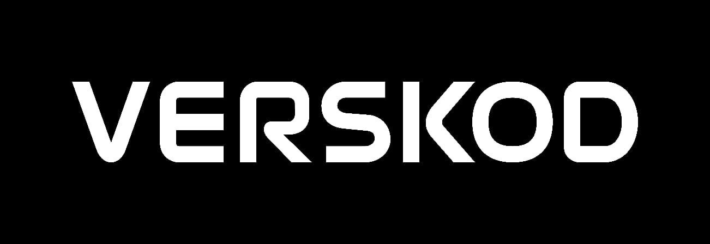

## 📖 ¿Quiénes somos?

**Verskod** es una empresa especializada en **desarrollo de software** y **capacitación personalizada de IA** para organizaciones que buscan optimizar procesos, empoderar a sus equipos y explorar tecnologías emergentes. Ofrecemos soluciones a medida que combinan ingeniería, diseño y experiencia en inteligencia artificial.

---

## 🎯 Misión

- **Desarrollo de talento**  
  Potenciar las habilidades profesionales y cognitivas de cada miembro de tu equipo.  
- **Innovación aplicada**  
  Implementar proyectos tecnológicos disruptivos basados en IA y otras tecnologías emergentes.  
- **Productividad y bienestar**  
  Mejorar la eficiencia y la calidad de vida de las personas mediante herramientas y metodologías inteligentes.

---

## 🚀 Qué hacemos

1. **Soluciones a medida**  
   Creamos aplicaciones web y móviles desde cero, adaptadas a tus necesidades de negocio.  
2. **Integración de IA**  
   Desarrollamos y entrenamos modelos de lenguaje y visión para automatizar tareas y ofrecer experiencias conversacionales.  
3. **Capacitación corporativa**  
   Diseñamos programas de entrenamiento interactivo para que tu equipo adopte y saque provecho de la IA.  
4. **Consultoría tecnológica**  
   Asesoramos en arquitectura, buenas prácticas y escalabilidad de tus sistemas.

---

## 🛠️ Tecnologías principales

- **Frontend**: Next.js, React, TypeScript, Tailwind CSS  
- **Backend & APIs**: Node.js, Express, PostgreSQL, MongoDB  
- **IA & Machine Learning**: Python, PyTorch, TensorFlow, OpenAI GPT  
- **DevOps & Deploy**: Vercel, Docker, GitHub Actions  
- **Móvil & PWA**: React Native, Progressive Web Apps (PWA)  

---

## 📂 Primer proyecto: Alva

Nuestro **primer lanzamiento** es **Alva**, un asistente de IA para acompañar tus mañanas y noches con mensajes motivacionales, playlists personalizadas y reflexiones diarias. Puedes conocer su Alva aquí:

▶️ https://alvaassistant.vercel.app//

---

## ⚙️ Instalación y desarrollo local

Clona este repositorio y arranca el entorno de desarrollo:

```bash
git clone https://github.com/DiegoCM1/verskod-landing.git
cd verskod-landing
npm install
npm run dev
Abre tu navegador en http://localhost:3000.
```

## 📦 Despliegue
Este proyecto está configurado para deploy automático en Vercel. Cada push a la rama main genera una nueva versión en producción.

## 📄 Licencia
Este repositorio es de uso interno de Verskod. Para más detalles sobre términos y condiciones, consulta el documento de políticas internas.
